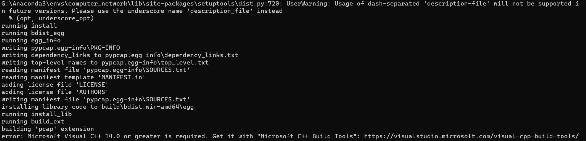

# IPWatch

An IP packets capture and analysis program based on PyQT.

## Environment setting

- Create a virtual environment by anaconda.

```bash
    conda create -n $env_name python=3.6 
    conda activate $env_name 
```

- Install the PyQT5 and PyQT5-tools dependencies, and you can refer to this [blog](https://blog.csdn.net/qq_42941807/article/details/104221498) for more detail information.

```bash
    pip install PyQt5
    pip install PyQt5-tools
```

- Install the PyPCAP dependency, and for more installation details please refer to the [PyPCAP Documentation](https://pypcap.readthedocs.io/en/latest/). For **Windows users**, you should install PyPCAP from the source code, and you can refer to the github repository [pypcap](https://github.com/pynetwork/pypcap). And there is a more clear [instruction manual](https://www.litreily.top/2018/12/31/pypcap-install/).

> **Attention:**  \
> You may face the problem as follows when you install the PyPCAP as the instruction tutorial (https://www.litreily.top/2018/12/31/pypcap-install/). \

> This means you need to install Microsoft Visual C++ Building Tools. [Installation Tutorial](https://stackoverflow.com/questions/40504552/how-to-install-visual-c-build-tools)

[PyQT5教程](https://pythonpyqt.com/pyqt-qlineedit/)