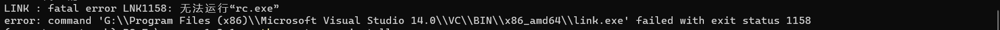
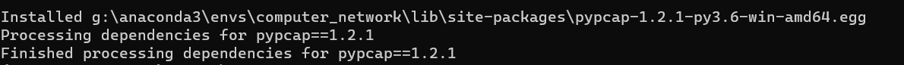
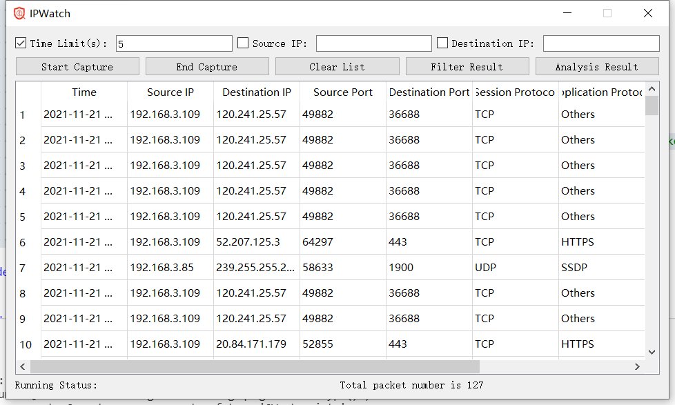

# IPWatch

An IP packets capture and analysis program based on PyQT and raw socket.

## Environment setting

In this project, we capture the IP packets by **the raw socket** and use pyqt to realize the front-end visual interface, and code on Python environment.

- Create a virtual environment by anaconda.

```bash
    conda create -n $env_name python=3.6 
    conda activate $env_name 
```

- Install the PyQT5 and PyQT5-tools dependencies, and you can refer to this [blog](https://blog.csdn.net/qq_42941807/article/details/104221498) for more detail information.

```bash
    pip install PyQt5
    pip install PyQt5-tools
```

- IP packet Capture by row socket mode, refer to this [blog](https://zhuanlan.zhihu.com/p/111610535).

And if you want to capture the ip packet by PyPcap，you can install the PyPcap as follows.

- Install the PyPCAP dependency, and for more installation details please refer to the [PyPCAP Documentation](https://pypcap.readthedocs.io/en/latest/). For **Windows users**, you should install PyPCAP from the source code, and you can refer to the github repository [pypcap](https://github.com/pynetwork/pypcap). And there is a more clear [instruction manual](https://www.litreily.top/2018/12/31/pypcap-install/).

> **Attention Please:**
> - You may face the problem as follows when you install the PyPCAP as the [tutorial](https://www.litreily.top/2018/12/31/pypcap-install/).
> 
> This means you need to install Microsoft Visual C++ Building Tools. [Installation Tutorial](https://stackoverflow.com/questions/40504552/how-to-install-visual-c-build-tools)  
> - Another Error: `error: command 'G:\\Program Files (x86)\\Microsoft Visual Studio 14.0\\VC\\BIN\\x86_amd64\\cl.exe' failed with exit status 2`, which may means you need to install `windows xx SDK`.
> - And if you meet the problem in follow picture, you can fix this error by refering to [this](https://stackoverflow.com/questions/35215971/lnk1158-cannot-run-rc-exe-x64-visual-studio).  

> - Once you install `PyPCAP` successfully, you may get this response.


## Coding tutorials

- [PyQT5 Tutorial](https://pythonpyqt.com/pyqt-qlineedit/)
- [PyPCAP Tutorial](https://pypcap.readthedocs.io/en/latest/)
- [PyPCAP Blog](https://www.litreily.top/2018/12/31/pypcap-install/)

## Display

Final version interface display:



Functional support：

- [x] ip packets capture
- [x] packet capture duration time limit
- [x] filter the packets captured by device according to the source IP and distination IP
- [x] terminal the packet capture thread in advance
- [x] clear the packet list
- [x] analyse the packets by protocol and application service
- [ ] display the details of IP packet

For more details, please refer to the [report.pdf](./report.pdf).

## How to run

- You can down load the [released version project](https://github.com/Jack-Lio/IPWatch/releases), and execute the main.exe file with administrator privileges.

- `python main.py`